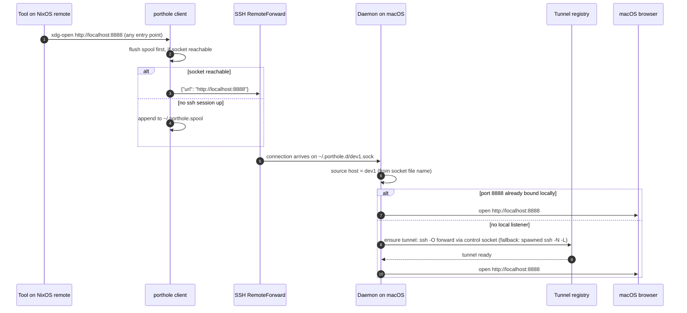
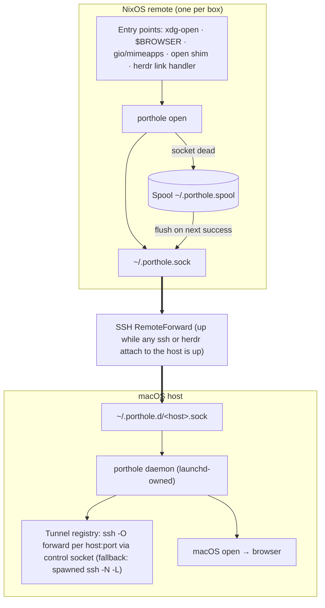

# porthole — Architecture

Status: built and smoke-tested. Name: `porthole`. The CLI installs as `porthole` with a `ph` symlink.

Primary targets: macOS as the local host, NixOS as the remote OS. Everything else is secondary.

## 1. Purpose

porthole opens URLs from remote machines in the local macOS browser. A tool on a NixOS remote calls `xdg-open <url>` or any equivalent entry point. The URL arrives in the default macOS browser.

If the URL targets a loopback port on the remote, the system first creates an SSH tunnel for that port. The browser then reaches the remote service through the tunnel. The user does nothing.

OAuth flows get the same treatment from the other direction. The authorize URL carries the loopback callback in its query (`redirect_uri` and friends), and the browser is redirected there without porthole ever seeing that URL. The daemon sniffs the callback port out of every opened URL's query parameters and pre-tunnels it, so the IdP's redirect back to localhost lands on a live tunnel.

## 2. Design rules

- Nix manages every component on both sides. Owned machines get no imperative install steps.
- The remote runs no daemon. The remote side is a stateless client plus a spool file.
- SSH owns the transport. herdr owns nothing in the critical path.
- One binary serves every role: daemon, client, and admin tool. Roles are feature-gated, not target-gated: the daemon code is unix-portable but irrelevant on remotes, so the `daemon` cargo feature (default on) gates daemon/status/tunnel and the tokio dependency. The remote build uses `--no-default-features`, ships only `open`, and never compiles tokio. `open` stays in both builds — on macOS it doubles as the daemon's local test harness.

## 3. Components

### 3.1 macOS host

**Daemon.** Listens on one Unix socket per remote host under `~/.porthole.d/`. Validates URLs. Manages tunnels. Calls `open`. A launchd agent owns the process and restarts it after a crash.

**Socket directory.** `~/.porthole.d/<host>.sock`. The socket file name identifies the source host. This solves multi-host attribution without metadata or mapping tables.

**Tunnel registry.** Tracks one ssh port forward per host and port. Two mechanisms, one policy. When the host's session multiplexes — the generated ssh config sets `ControlPath ~/.porthole.d/control/%n`, so the control socket name is the host alias the daemon already knows — a forward is one synchronous `ssh -S <sock> -O forward -L <port>:localhost:<port>` round trip to the live master. Nothing to spawn or supervise, and forwards die with the connection, which is the right lifetime. Sessions without a control socket (hand-rolled configs) get a spawned `ssh -N -L` child instead, reaped on exit. In v1, tunnels live for the connection (mux) or the daemon lifetime (child).

**CLI.** The same binary. Subcommands: `daemon`, `open`, `status`, `tunnel`. The nix module installs the binary as `porthole` plus a `ph` symlink for typing.

**SSH configuration.** home-manager `programs.ssh.matchBlocks` declares one `RemoteForward` per host. The remote path is uniform: `~/.porthole.sock`. The local path is per-host: `~/.porthole.d/<host>.sock`. Herdr's own remote ssh includes this config, so `herdr --remote <host>` attaches bring the socket up too.

**herdr plugin.** A thin manifest in the same repo. Optional at runtime. See section 5.

### 3.2 NixOS remote

**Client.** The `open` subcommand. It writes one JSON line to `~/.porthole.sock`. If the socket is absent or refused, it appends to `~/.porthole.spool`. Each invocation flushes the spool first when the socket accepts connections.

**Browser registration.** Fully declarative through home-manager. `xdg.desktopEntries` provides `porthole.desktop`. `xdg.mimeApps.defaultApplications` binds `x-scheme-handler/http` and `x-scheme-handler/https`. `home.sessionVariables.BROWSER` covers stock `xdg-open` and every tool that reads `$BROWSER`. A small `open` shim covers macOS-style calls. `home.sessionVariables.DISPLAY` spoofs a display for launchers that gate on one (gcloud's `check_browser.py` requires `DISPLAY`, `WAYLAND_DISPLAY`, or `MIR_SOCKET` and never reads `$BROWSER`). Debian alternatives do not apply on NixOS.

**sshd hygiene.** `services.openssh.settings.StreamLocalBindUnlink = true` lets sshd replace a stale remote socket on reconnect.

### 3.3 What herdr contributes

The plugin provides a link handler and actions. A Ctrl+click on a loopback URL in a herdr pane routes to `porthole open` instead of a direct browser open. This fixes the dead-browser-tab case when no tunnel exists yet.

During a `herdr --remote` attach, the link handler action runs on the remote server. It writes to the same forwarded socket. The attach itself guarantees that the socket is alive at that moment.

Herdr provides no transport, no process supervision, and no plugin-side daemon.

## 4. The path of a URL

## 5. Component map

## 6. Multi-host model

Each remote forwards to its own local socket path. The daemon learns the source host from the socket file name. There are no hostname mapping tables and no trusted payload fields.

Two remotes can serve the same loopback port at the same time. The first tunnel wins the local port. A later request for the same local port from a different host fails with a clear error. A later version can add explicit local-port remapping. The daemon then rewrites the URL before `open`.

## 7. Ownership

| Layer | Owner | Mechanism |
|---|---|---|
| Binary, both sides | nix | Package in the system flake |
| Daemon lifecycle | launchd | home-manager `launchd.agents`, KeepAlive |
| SSH transport | home-manager | `programs.ssh.matchBlocks`, one RemoteForward per host |
| Remote socket hygiene | NixOS | `services.openssh.settings.StreamLocalBindUnlink` |
| Browser registration | home-manager on NixOS | `xdg.mimeApps`, `xdg.desktopEntries`, `sessionVariables.BROWSER` |
| Click routing in TUI | herdr | Plugin link handler, linked by a home-manager activation |

## 8. Failure modes

- **No ssh session to the remote.** The remote socket is dead. The client appends to the spool. The next successful call flushes it. URLs from detached agents arrive late, not never.
- **Daemon restart.** Mux forwards belong to the ssh connection and survive; the restarted daemon's first ensure finds the port already bound and treats it as local-wins — the correct outcome behind a confusing log line. Spawned child tunnels die with the daemon; the next URL recreates them on demand.
- **Disconnect is soft.** ControlPersist keeps the ssh master (and with it the RemoteForward and any mux forwards) alive for an hour after the last session closes. URLs keep arriving until it expires; after that, the client spools.
- **Stale remote socket after a dropped connection.** `StreamLocalBindUnlink` replaces it on the next connect.
- **Local port already bound by an unrelated local process.** Local wins. The daemon opens the URL without a tunnel and logs the decision. Explicit remapping is the escape hatch.
- **Callback URLs the sniff cannot see.** SAML CLI flows hide the ACS URL inside the base64 SAMLRequest blob; oauth-proxy interstitials double-encode it. Those flows break at the redirect. If one bites, the fix is an explicit `porthole forward <port>` verb on the remote — a one-line protocol addition, deliberately not built yet.
- **herdr not installed.** Everything except click routing still works.

## 9. What we build

1. The `porthole` binary: daemon, client, and admin roles. Language is an open decision.
2. A nix package plus two modules: a darwin/home-manager module and a NixOS-remote home-manager module.
3. The herdr plugin manifest in the same repo.
4. An `install-remote` subcommand for non-nix remotes. Secondary target.
5. Documentation.

## 10. Non-goals for v1

Scope notes, not doctrine — most of these fall when they itch. Two are load-bearing: the http/https-only rule is a safety boundary (the daemon hands the string to `open(1)`), and "no daemon on remotes" is what makes the spool design exist.

- No daemon on remotes.
- No supervision through herdr startup hooks.
- No idle reaping of tunnels.
- No Linux or Windows local host. No WSL.
- Only `http` and `https` URLs pass validation.

## 11. Open decisions

- Implementation language: decided (2026-08-16). Rust, single-threaded tokio (`new_current_thread`; `rt-multi-thread` not compiled in). Hand-rolled CLI parsing, no clap. No tracing/anyhow until structure earns it.
- Tunnel idle and teardown policy past v1.
- Multiplexed tunnel architecture: considered and rejected (2026-08-17). A single porthole-to-porthole mux per host (own both sockets, real observability) breaks the load-bearing rule — no daemon on remotes — and replaces the zero-code ssh tunnel layer with a hand-rolled wire protocol (framing, flow control, versioning). If true traffic observability ever matters, idle detection's composite signal (last_requested + lsof established check) is the cheap answer. This is the sshuttle shape: a good different project. The rejection's own escape hatch was adopted (2026-08-18): per-port forwards now go through ControlMaster + `ssh -O forward` on the session's control socket, with spawned `ssh -N -L` children as the fallback. The trigger was OAuth callback pre-tunneling (sniffing `redirect_uri`-style loopback URLs out of opened URLs' query parameters), which made per-port process spawns feel silly; rcrowley's opener branch proved the pattern. Note the attribution story differs from opener's: porthole needs no in-band %C metadata because the per-host RemoteForward socket names the host, and `ControlPath %n` makes host → control socket a path join.
- Spool size limits and flush triggers past "next successful call". Includes staleness: the spool stays in $HOME because /run/user/$UID can vanish under detached agents (logind removes it at last logout without linger). If post-reboot delivery of dead loopback URLs ever bites, stamp spool lines with /proc/sys/kernel/random/boot_id and discard on mismatch — /run semantics without /run fragility. Also open: flush *timing* — "next successful call" delivers stale URLs at random mid-session moments; flushing on session establishment (ssh attach / login hook) arrives at the least surprising moment. And a TTL on flush, since the transport can't see intent: an SSO login link and a dev-server URL differ only in shelf life, and TTL approximates shelf life.
